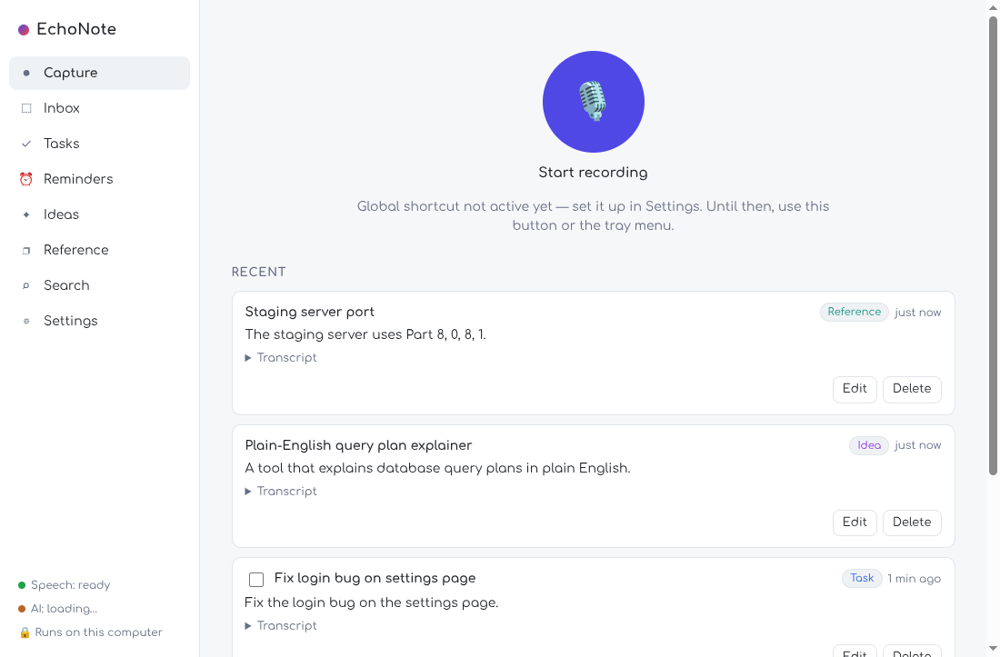
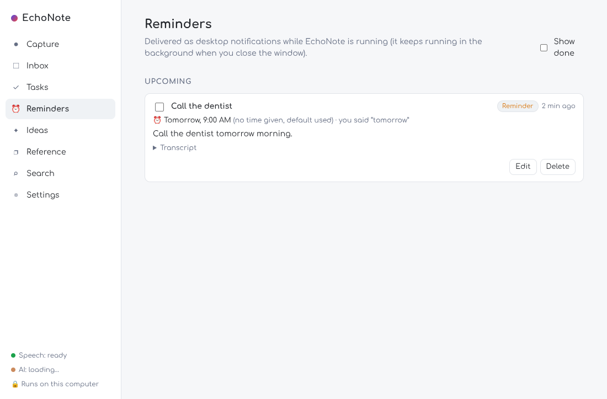
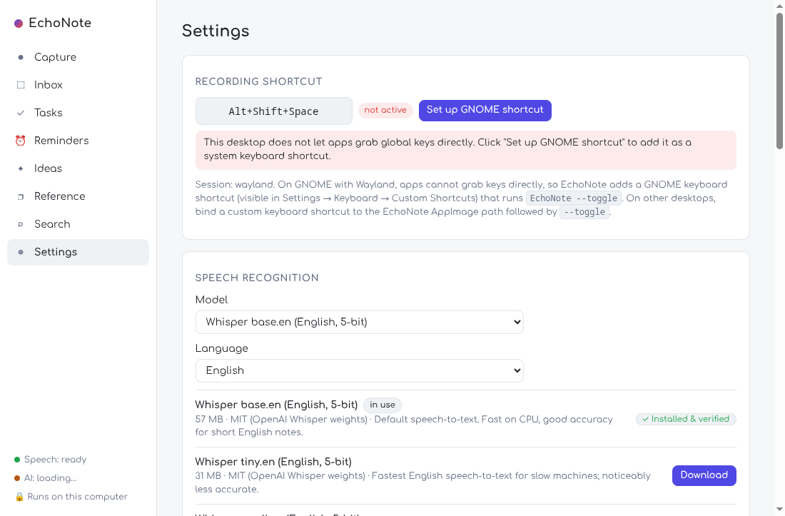

# EchoNote

**Press a shortcut, say what's on your mind, keep working.** EchoNote turns the thought into a task,
reminder, idea or reference note — using speech recognition and a language model that run entirely
on your own computer.

* 🎙 **Capture in one keystroke** from any app. A small overlay shows that the microphone is live.
* 📝 **Local speech-to-text** with [whisper.cpp](https://github.com/ggml-org/whisper.cpp).
* 🧠 **Local organizing** with [llama.cpp](https://github.com/ggml-org/llama.cpp) and Qwen2.5-1.5B-Instruct:
  category, short title, summary, action, and the date phrase you said.
* ⏰ **Reminders** with desktop notifications, scheduled from SQLite and restored after restarts.
* 📥 **Nothing is ever lost**: the transcript is saved before the AI runs. If the model is loading,
  missing, slow or wrong, the note waits in the Inbox.
* 🔒 **Offline after setup.** No account, no API key, no telemetry, no cloud.

| Capture | Reminders | Settings |
| --- | --- | --- |
|  |  |  |

Built for the [DEV Hacktoberfest Weekend Challenge 2026](https://dev.to/challenges/hacktoberfest-weekend-2026-10-01) ("Build for a Friend").

---

## Install (Linux x86-64)

1. Download `EchoNote-1.0.0-x86_64.AppImage` and make it executable:
   ```bash
   chmod +x EchoNote-1.0.0-x86_64.AppImage
   ./EchoNote-1.0.0-x86_64.AppImage
   ```
   (Fedora ships FUSE for AppImages. On distributions without it, install `fuse`/`libfuse2`, or run
   with `--appimage-extract-and-run`.)
2. The first-run screen downloads two model files (1.1 GB total) from Hugging Face and verifies their
   SHA-256 checksums. **This is the only time EchoNote uses the network.**
3. Click **Set up GNOME shortcut** (on GNOME/Wayland) — the default shortcut is <kbd>Alt</kbd>+<kbd>Shift</kbd>+<kbd>Space</kbd>.

Nothing else is needed: no Node.js, Python, Ollama, compiler, database server or manual model files.
The inference runtimes (`whisper-server`, `llama-server`) are inside the AppImage.

**Requirements:** x86-64 CPU with AVX2 (Intel Haswell / AMD Zen or newer), ~2.5 GB free RAM for the
default models (a 0.5B model is available for low-memory machines), ~1.2 GB disk for models.
Tested on Fedora 44, GNOME 50 (Wayland). Other distributions/desktops are untested.

## Using it

* Press the shortcut (or the big button, or the tray menu), speak, press it again.
* Within a few seconds the note appears under **Tasks / Reminders / Ideas / Reference**.
* If EchoNote isn't sure — e.g. "remind me next Friday" said on a Tuesday, a reminder with no date, or
  an unclear category — the note goes to **Inbox → Needs confirmation** with the reason and a
  pre-filled date you can correct.
* Search finds text in transcripts, titles and summaries.
* Closing the window keeps EchoNote running in the background so reminders and the shortcut work.
  Quit from the tray menu or Settings.

## How it works

```text
shortcut ─► recorder (renderer, 16 kHz WAV) ─► SQLite capture row ─► whisper-server ─► transcript saved
                                                                                         │
                         reminder scheduler ◄─ validated record ◄─ zod + date resolver ◄─ llama-server (JSON grammar)
```

* The LLM never computes dates; it copies the date *phrase* ("tomorrow at 7 pm"). A deterministic
  resolver (chrono-node, local timezone) turns it into a time, and a phrase that does not occur in
  the transcript is discarded — so deadlines are never invented.
* Model output is treated as untrusted input: JSON-schema-constrained decoding, then strict validation.
* Both inference servers are started once and stay warm; the shared prompt is cached at startup.

Details: [docs/ARCHITECTURE.md](docs/ARCHITECTURE.md) · [docs/PRIVACY.md](docs/PRIVACY.md) ·
[docs/TROUBLESHOOTING.md](docs/TROUBLESHOOTING.md)

## Models

| Purpose | Model | Size | License |
| --- | --- | --- | --- |
| Speech (default) | Whisper base.en, 5-bit (ggml) | 57 MB | MIT (OpenAI Whisper weights) |
| Speech (options) | Whisper tiny.en / small.en / small (multilingual, for Hindi/Hinglish – experimental, untested) | 31–181 MB | MIT |
| Organizing (default) | Qwen2.5-1.5B-Instruct, Q4_K_M GGUF | 1.04 GB | Apache-2.0 |
| Organizing (low memory) | Qwen2.5-0.5B-Instruct, Q4_K_M GGUF | 469 MB | Apache-2.0 |

All are open-weight models; Qwen2.5 weights are Apache-2.0, the Whisper weights are MIT. The training
data of these models is not open, so they are "open-weight", not fully open-source AI.

## Measured performance

Development machine: Intel i7-13620H (6P+4E cores, 16 threads), 16 GB RAM, Fedora 44, GNOME 50
Wayland, **CPU only**, system power profile *quiet* / `powersave` governor (as configured by the
owner — expect better numbers in Balanced/Performance mode). Numbers from the automated suites in this
repo (`docs/benchmarks/`, `captures.timings`).

| Operation | Measured |
| --- | --- |
| App window ready | 0.22 s (dev), 0.67 s (AppImage, incl. FUSE mount) |
| Shortcut → app receives toggle (GNOME shortcut via named pipe) | 17–27 ms (warm); 1.4 s if EchoNote has to be started |
| Toggle → microphone recording | 0.13–0.58 s (getUserMedia + AudioWorklet start) |
| Stop → audio persisted | ~0.15 s |
| whisper base.en load / transcription of a 3–11 s clip | 0.23–0.5 s / 1.8–2.3 s |
| llama-server load / prompt-cache warm-up (once per launch) | 2.0–2.9 s / 15–17 s |
| LLM classification, warm (1.5B) | median 5.4 s, range 4.4–6.0 s |
| LLM classification, warm (0.5B) | median 2.8 s |
| Stop → organized note in the app (1.5B) | 7.4–8.3 s (transcript visible after ~2.3 s) |
| Classification accuracy, 8-sentence test set | 1.5B: 8/8 · 0.5B: 6/8 |
| Memory (RSS) after startup / after 5 captures | llama-server 1.9 / 1.9 GB · whisper-server 105 / 164 MB · Electron (all processes, shared pages counted repeatedly) 0.74 / 0.96 GB |

Speech model comparison (same machine, synthetic espeak voice, which is harder than a human voice):

| Model | Load | Short clip | RSS | Notes |
| --- | --- | --- | --- | --- |
| tiny.en q5_1 | 0.15 s | 0.9 s | 111 MB | most errors |
| **base.en q5_1** | 0.22 s | 1.8 s | 160 MB | **default** – good balance |
| small.en q5_1 | 0.42 s | 6.5 s | 353 MB | most accurate, ~3.5× slower |

**Targets not met on this machine:** the spec's "warm LLM P95 < 2 s" — warm classification takes
~5 s with the 1.5B model on this throttled CPU (generation runs at ~12 tokens/s). The transcript is
saved and visible ~2 s after you stop, so nothing waits on the LLM, but organizing is not instant.
The 0.5B model is ~2× faster at lower accuracy. GPU offload is not implemented (the build machine has
no CUDA/Vulkan SDK).

## Testing

```bash
npm test                    # 96 unit tests: validation, dates, DB, pipeline, reminders, downloads, IPC, audio
npm run test:integration    # real whisper.cpp + llama.cpp on the real models (8 tests)
npm run test:e2e            # 7 end-to-end workflows driving the built Electron app
```

The end-to-end suite feeds WAV files into Chromium's fake microphone and drives the app exactly like
the GNOME shortcut does (`--toggle`). It covers: reference note persisted & searchable after restart;
a "remind me in two minutes" reminder delivered exactly once and not re-delivered after restart; a
future reminder restored after restart; the LLM missing → transcript kept in the inbox → organized
after the model returns, without duplicates; first-run setup with a failed then successful real model
download; an invalid shortcut, denied microphone and duplicate-toggle protection; and a full
capture → transcription → classification run **inside a Linux network namespace with no network
interface** (offline). The same suites were run against `dist/linux-unpacked` and the AppImage
(`ECHONOTE_E2E_EXE=…`).

Not automated: actually pressing a key on a physical keyboard, a real human voice, and the visual
appearance of the desktop notification — check these manually (see below).

## Build from source

Requires Node.js 24 (`.nvmrc`), git, g++, cmake (or `CMAKE="uvx --from cmake cmake"`).

```bash
npm ci
npm run native:build        # builds whisper-server + llama-server into resources/bin/linux-x64
npm run models:prepare      # optional: pre-download default models to ~/.config/EchoNote/models
npm run dev                 # run in development
npm run package:linux       # -> dist/EchoNote-1.0.0-x86_64.AppImage
```

## Limitations

* Linux x86-64 only; tested on Fedora 44 / GNOME 50 Wayland. Windows/macOS are not supported yet (the
  main-process logic is portable; packaging, shortcuts and runtimes are not done).
* On GNOME Wayland, Electron cannot register global shortcuts (tested: returns false even with the
  GlobalShortcutsPortal feature), so EchoNote installs a GNOME custom keyboard shortcut on request.
  Other Wayland desktops need a manually bound shortcut running `EchoNote… --toggle`.
* Reminders fire only while EchoNote is running. Missed reminders are shown as overdue at next start.
  Launch-at-login is available for the AppImage build.
* English is the tested language. The multilingual Whisper model for Hindi/Hinglish is selectable but
  has not been tested with real speech.
* One primary intent per recording; a note containing several tasks becomes one item.
* The tray icon needs the AppIndicator extension on GNOME.
* Models are downloaded at first run (not bundled) to keep the AppImage at 135 MB.

## License

MIT for EchoNote's code. Bundled runtimes: whisper.cpp and llama.cpp (MIT). Models are downloaded
from their publishers under their own licenses (see the table above).
